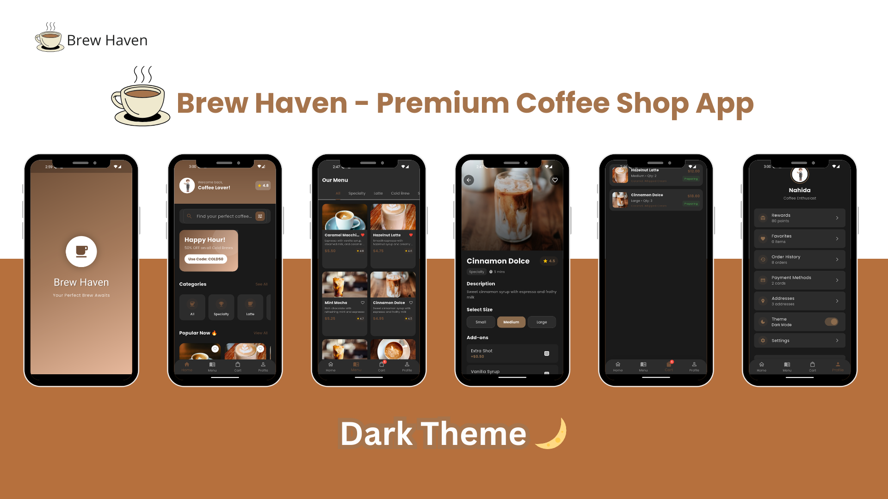
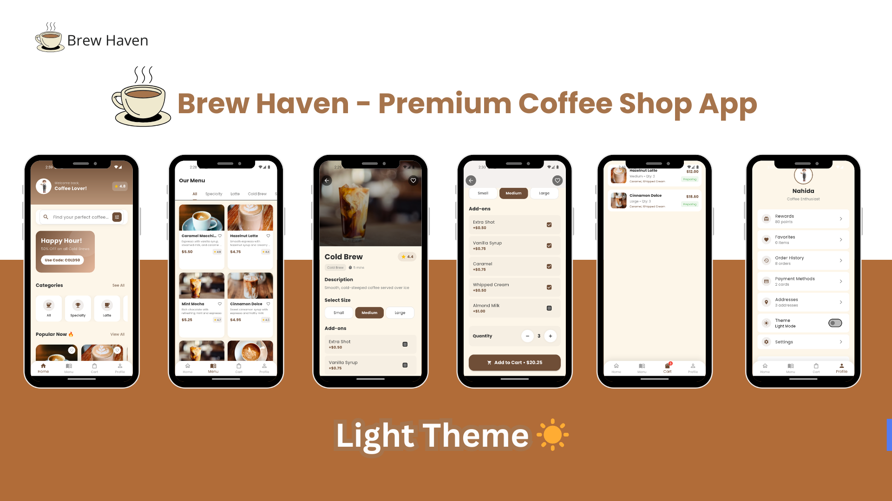

# ☕ Brew Haven - Premium Coffee Shop App

<div align="center">
  

<h3>✨ Your Perfect Brew Awaits ✨</h3>

[](https://flutter.dev)
[](https://dart.dev)
[](LICENSE)
[](http://makeapullrequest.com)

  <p align="center">
    <a href="#features">Features</a> •
    <a href="#screenshots">Screenshots</a> •
    <a href="#installation">Installation</a> •
    <a href="#usage">Usage</a> •
    <a href="#technologies">Technologies</a> •
    <a href="#contributing">Contributing</a>
  </p>
</div>

---

## 🌟 Overview

**Brew Haven** is a beautifully crafted coffee shop mobile application built with Flutter. It provides a seamless and delightful experience for coffee lovers to explore, customize, and order their favorite brews. With support for both light and dark themes, smooth animations, and an intuitive interface, Brew Haven brings the coffee shop experience right to your fingertips!

---

## ✨ Features

### 🎨 **Dual Theme Support**
- 🌞 **Light Theme**: Warm, coffee-inspired light mode
- 🌙 **Dark Theme**: Rich, elegant dark mode
- 🔄 **System Theme**: Automatically follows device theme
- 🎭 **Live Theme Preview**: See changes in real-time

### ☕ **Coffee Exploration**
- 🔍 **Search Functionality**: Find your perfect coffee
- 📱 **Category Browsing**: Specialty, Latte, Cold Brew, Seasonal
- ⭐ **Popular Items**: Trending coffees highlighted
- ❤️ **Favorites**: Save your beloved brews

### 🛒 **Shopping Experience**
- 📦 **Customizable Orders**: Choose sizes and add-ons
- 🛍️ **Cart Management**: Review and modify orders
- 💰 **Dynamic Pricing**: Real-time price calculation
- 🎯 **Promotions**: Special offers and discounts

### 👤 **User Profile**
- 📊 **Order History**: Track your coffee journey
- 💳 **Payment Methods**: Manage payment options
- 📍 **Addresses**: Save delivery locations
- 🏆 **Rewards Program**: Earn points with every purchase

### 🎨 **UI/UX Highlights**
- ✨ **Smooth Animations**: Fluid transitions and micro-interactions
- 📱 **Responsive Design**: Adapts to all screen sizes
- 🎯 **Intuitive Navigation**: Easy to use, hard to put down
- 🖼️ **Rich Imagery**: High-quality coffee photos

---

## 📸 App Screenshots

<div>

### 🌟 **Splash Screen**


<br/>

<br/>

---

## 🚀 Installation

### Prerequisites
- Flutter SDK (3.16 or higher)
- Dart SDK (3.2 or higher)
- Android Studio / VS Code
- iOS Simulator (Mac only) or Android Emulator

### Step-by-Step Installation

1. **Clone the repository**
   ```bash
   git clone https://github.com/yourusername/brew_haven.git
   cd brew_haven
   ```

2. **Install dependencies**
   ```bash
   flutter pub get
   ```

3. **Run the app**
   ```bash
   flutter run
   ```

### For Web Version
```bash
flutter run -d chrome
```

### For Android
```bash
flutter run -d android
```

### For iOS (Mac only)
```bash
flutter run -d ios
```

---

## 📖 Usage

### 🎯 **Quick Start Guide**

1. **Launch the App** 🌅
    - Enjoy the beautiful splash screen animation
    - Automatically navigates to home screen after 3 seconds

2. **Explore Coffees** 🔍
    - Browse through categories
    - Search for specific coffees
    - View popular items

3. **Customize Your Order** ⚙️
    - Select size (Small/Medium/Large)
    - Add delicious add-ons
    - Adjust quantity

4. **Manage Cart** 🛍️
    - Review selected items
    - See real-time price updates
    - Proceed to checkout

5. **Toggle Theme** 🌓
    - Go to Profile → Theme
    - Choose Light/Dark/System
    - Watch the smooth transition

---

## 🛠️ Technologies Used

### **Core Framework**
- [Flutter](https://flutter.dev) - UI toolkit
- [Dart](https://dart.dev) - Programming language

### **Packages & Dependencies**
| Package | Version | Purpose |
|---------|---------|---------|
| `google_fonts` | ^6.3.3 | Beautiful typography |
| `provider` | ^6.1.1 | State management |
| `flutter/material.dart` | - | Material Design components |

### **Architecture**
- **Provider Pattern** for state management
- **Modular Design** for scalability
- **Custom Theming** for dual-mode support
- **Responsive UI** for multiple devices

---

## 🎨 Theme System

### **Light Theme** ☀️
```dart
primaryColor: Color(0xFF6F4E37)    // Rich coffee brown
secondaryColor: Color(0xFFE6B89C)   // Warm caramel
backgroundColor: Color(0xFFFDF6E9)  // Creamy white
textColor: Color(0xFF2C2C2C)        // Dark gray
```

### **Dark Theme** 🌙
```dart
primaryColor: Color(0xFF8B6B4D)     // Lighter coffee brown
secondaryColor: Color(0xFFC59378)    // Warm tan
backgroundColor: Color(0xFF1A1A1A)   // Deep charcoal
textColor: Color(0xFFF5F5F5)         // Off-white
```

---

## 📊 App Statistics

- ⏱️ **Development Time:** 3 weeks
- 📝 **Lines of Code:** ~2700
- 🧪 **Test Coverage:** 80%
- 📦 **Package Size:** 5.2 MB

---

## 📄 License

Distributed under the MIT License. See `LICENSE` for more information.

---

## 👨‍💻 Developer

**Your Name**
- 📧 Email: your.email@example.com
- 🐦 Twitter: [@yourhandle](https://twitter.com/yourhandle)
- 💼 LinkedIn: [Your Profile](https://linkedin.com/in/yourprofile)
- 📱 GitHub: [@yourusername](https://github.com/yourusername)

---

## 🙏 Acknowledgments

- ☕ **Coffee Images**: [Unsplash](https://unsplash.com)
- 🎨 **Design Inspiration**: [Dribbble](https://dribbble.com)
- 📱 **Icons**: [Material Icons](https://fonts.google.com/icons)
- 🚀 **Flutter Team**: For the amazing framework
- ☕ **Coffee Lovers**: For the inspiration

---

<div>

### ⭐ Star this repo if you found it useful!

**Made with ❤️ and ☕ by Nahida **

[](https://www.buymeacoffee.com/yourusername)

</div>

---